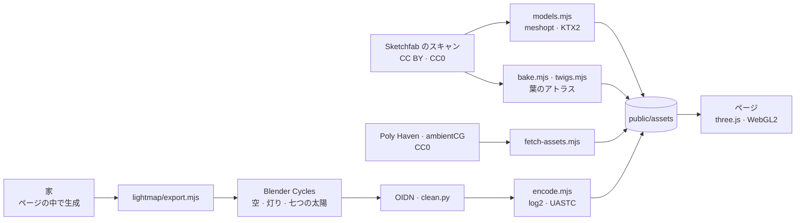

<p align="center">
  <a href="https://billpwchan.github.io/utsuroi/"></a>
</p>

<p align="center">
  <b>京の家と庭を、夜明けから夜まで歩く。ブラウザの中で、リアルタイムに。</b><br>
  スクロールすれば、一日が過ぎてゆく。
</p>

<p align="center">
  <a href="https://billpwchan.github.io/utsuroi/"><b>サイトを開く</b></a>&nbsp;&nbsp;·&nbsp;&nbsp;<a href="#つくりかた">つくりかた</a>&nbsp;&nbsp;·&nbsp;&nbsp;<a href="#手元で動かす">手元で動かす</a>&nbsp;&nbsp;·&nbsp;&nbsp;<a href="CREDITS.md">クレジット</a>
</p>

<p align="center">
  <a href="https://github.com/billpwchan/utsuroi/actions/workflows/pages.yml"></a>
  
  
  <a href="LICENSE"></a>
</p>

<p align="center"><sub><a href="README.md">English</a> · <a href="README.zh-CN.md">简体中文</a> · <b>日本語</b></sub></p>

<br>

> **移ろい**：うつりかわること。色が、季節が、光が、見ているうちに変わってゆくさま。

京都・北山の一軒の家を歩く。夜明け前の門から夜の鯉の池まで、十四の場所を一本のカメラの道がつなぐ。スクロールは時計でもある。部屋から部屋へ移るあいだに日は傾き、立ち止まっても時は止まらない。

石も木も灯籠も茶碗も、実在するものをスキャンし、あるいはモデリングしたもの。家は京間の寸法でコードから組み上げ、室内の光はオフラインでパストレースして、時刻ごとに混ぜ合わせる。描画解像度を調整する governor が、ブラウザのタブの中で毎秒 60 フレームを保つ。

<p align="center">
  
  <br><sub>04:45 から 21:00 までの、池からの同じ眺め。キーフレームは一つもない。日は京都の空をなぞって動き、日が沈むと灯はひとりでにともる。</sub>
</p>

## 歩く


門（夜明け前）→ 露地 → 玄関 → 入側 → 座敷 → 茶室 → 渡廊下（正午）→ 囲炉裏 → 縁側 → 枯山水 → 寝室 → 湯殿（夕暮れ）→ 夜 → 間取り（真上から）。

二つの場所のあいだでは、カメラはスクロール区間の中ほどだけを進み、両端では止まったまま時計だけが回る。だから立ち止まって少しスクロールすれば、光が動くのだけを眺められる。

## 四季


いつでも <kbd>1</kbd>–<kbd>4</kbd> で季節が変わる。春は花びらが舞い、夏の夜には流れの上に蛍が浮かぶ。秋は楓が色づいて葉を落とし、冬は屋根と灯籠に雪が積もって、鯉は深く沈む。一日の時刻表はどの季節も同じなので、どの季節も同じ道のりで歩ける。

## 画面


読み込みのあいだ、家は 1:250 の平面図として描かれる。3D の世界を組み立てるのと同じ数字から引いた図面である。場所ごとに英語と日本語の章カードが現れる。右の目盛りは朝五時から夜九時までの日の道。最後の場所では図面が地図になり、部屋を選べばそこへ戻れる。

音は任意で、すべてその場で合成している。音源のダウンロードはない。
- 風、竹、流れ、蹲踞の滴り。
- 春の朝の鶯、夏の日の蝉、夜の鈴虫。
- 鉄瓶の松風、足もとで鳴る鶯張り。
- 日の出と日の入りには遠い寺の鐘。

| キー | |
|---|---|
| スクロール、<kbd>↓</kbd> <kbd>→</kbd> <kbd>Space</kbd> | 次の場所 |
| <kbd>↑</kbd> <kbd>←</kbd> | 前の場所 |
| <kbd>Home</kbd> / <kbd>End</kbd> | 門 / 間取り |
| <kbd>1</kbd> <kbd>2</kbd> <kbd>3</kbd> <kbd>4</kbd> | 春・夏・秋・冬 |
| <kbd>M</kbd> | 音 |
| <kbd>P</kbd> | 写真モード。絵はがきも刷れる（<kbd>Esc</kbd> で戻る） |

## つくりかた

素の [three.js](https://threejs.org) r186 だけで書いている。エンジンもフレームワークも使っていない。すべての面は共通のシェーダーフックを当てた `MeshStandardMaterial` で、光も空気も季節も、ひと組の uniform を通してすべての面に届く。

### 光

- **日と空。** 太陽は北緯 35° の京都の空をなぞる。空、日差し、環境光の色は一つの単一散乱モデルから求め、空のシェーダーも同じものを使う。だから家に当たる光は、いつも背後の空と合っている。雲は半解像度でレイマーチする積雲の層で、フレームをまたいで積み重ねる。
- **家の中のベイク光。** 読み込むたびに、プロシージャルな家に二つめの UV を毎回同じ配置で与える。13,694 のチャートを 4096² のアトラスに棚詰めする。
  - **ベイク。** Blender Cycles がオフラインでそこへ焼き込む。一様な空、灯り、そして七つの時刻（06:00、07:30、09:00、11:30、14:30、16:30、18:00）の太陽の間接光。
  - **ノイズ除去。** OIDN がチャート ID と法線をガイドにノイズを除くので、チャートの光が隣へにじまない。最後の処理で、かすかな光の領域に残るファイアフライを取り除く。
  - **格納。** 部屋の光は庭の百分の一ほどしかないので、ライトマップは log2 で 8 bit にエンコードし、精度を各段の露出に均等に配る。保存形式はミップマップ付きの UASTC KTX2。
  - **実行時。** ページはその時刻の前後二枚の太陽ベイクを混ぜ、シャドウマップからの直射光を足す。
  - **プローブ。** 103 × 9 × 30、40 cm 間隔のプローブ格子が同じベイクを持ち、ライトマップのない物を照らす。
- **屋外。** 読み込み時に 25 cm ボクセルの空の可視性ボリュームを GPU で焼く。柱と床の取り合いのような接地の陰は SSAO が補う。
- **空気。** 1/4 解像度でシャドウマップの中をレイマーチして、ボリュームライトを描く。室内の空気は庭より埃っぽくしてあるので、部屋には光の筋が立ち、庭の眺めは澄んだままになる。
- **露出。** 明順応・暗順応は GPU で計算し、画面の中央に重みを置く。明るい戸口ひとつで暗い部屋の露出が決まってしまうことはない。最後に AgX トーンマッピング、ブルーム、グレーディング、粒子、シャープニング付きのアップスケールで仕上げる。

### 庭と家

- **一枚の敷地計画。** 池、流れ、築山、園路、塀の位置を一枚の敷地計画が持ち、地形も地面のシェーダーも水も石も植栽もそれを読む。だから互いにずれることがない。
- **石。** 石はすべてスキャン。庭の石と飛石は同じスキャンの配置をひとつのメッシュにまとめるので、全部で七つのドローコールで済む。
- **木。** 木はスキャンまたはモデリングした幹と枝に、葉のカードをつける。葉と花のアトラスは CC0 の標本スキャンから実寸で組み、葉そのものの法線を持たせてある。葉は無彩色のグレーで、季節の色はシェーダーでつける。
- **水。** 池には次のものがある。
  - 平面反射と、シーン越しの屈折。
  - 光路長による吸収。プールの水色ではなく、鯉の池の緑褐色に見える。
  - 風のさざ波、流れの水の動き、日のきらめき。
  - 池底のコースティクスと、鯉が浮くときの水輪。
- **鯉。** 七品種、十数尾の鯉が一尾のスキャンした鯉を共有し、背骨に沿って伝わる波で泳ぐ。
- **家。**
  - **間取り。** 京間の寸法でコードから生成する。一間 1.82 m、開口の高さ 1.76 m、柱 12 cm。四つの棟、入母屋の瓦屋根、障子・襖・ガラス戸。
  - **素材。** 本物の質感が要るところはスキャン素材を使う。畳、檜、土壁、石。和紙、唐紙、金箔は canvas で描いたテクスチャ。
  - **書画。** 掛軸と屏風は実在の作品の写真で、長谷川等伯の《松林図屏風》もある。

### 一フレーム

`shadow → mirror → opaque (MSAA) → sky (half res) → water and effects → volumetric light → bloom and adaptation → composite`

描画解像度の governor が 60 fps を保つ。フレームを落とせば解像度を下げ、きれいなフレームが続けばまた上げてみる。

Apple M4 Max の Chrome、1920 × 1080・2× での計測：
- 止まっているとき、p50 は 16.7 ms、p95 は 18.7 ms。
- 冒頭と速いスクロールではテクスチャの転送が入り、p99 はおよそ 33 ms。

テクスチャは KTX2 で、GPU 上で BC7 か ASTC に変換する。ジオメトリは meshopt で圧縮。初回の読み込みはおよそ 160 MB。



## 手元で動かす

```bash
git clone https://github.com/billpwchan/utsuroi.git
cd utsuroi
npm install
npm run dev          # http://127.0.0.1:5195
```

Node 20.19 以上か 22.12 以上と、WebGL2 の使えるデスクトップのブラウザが必要。開発と計測は Apple silicon の Chrome で行っている。ビルド済みのアセットをリポジトリに含めているので、clone はおよそ 160 MB になり、ほかに取ってくるものはない。`npm run build` で `dist/` に静的サイトができ、どの静的ホスティングにも置ける。`.github/workflows/pages.yml` が GitHub Pages へ公開し、`deploy/` には自前のサーバー用の Caddy と Docker の構成がある。

一か所に絞って作業するときは URL パラメータが使える。

| | |
|---|---|
| `?stop=6` | その場所から開く（0–13） |
| `?season=2` | 0 春、1 夏、2 秋、3 冬 |
| `?orbit&h=17.5` | 時刻を止めた自由なオービットカメラ（<kbd>[</kbd> <kbd>]</kbd> で 15 分ずつ） |
| `?clean` | 画面の表示を隠す |
| `?nolm` `?novol` `?noadapt` | ベイク光、ボリュームライト、明順応を切る |

### アセットを作り直す

サイトを動かすにも変えるにも、ここは要らない。パイプラインを読み、動かし直し、手を加えられるようにスクリプトを置いている。木の幹と葉を分ける作業や、行灯、一部のテクスチャ、書画のように、一度きりの手作業で用意して自動化していないものもある。

| | |
|---|---|
| `scripts/fetch-assets.mjs` | Poly Haven と ambientCG のテクスチャと岩 → KTX2（[`basisu`](https://github.com/BinomialLLC/basis_universal) が必要） |
| `scripts/sketchfab.sh`、`scripts/models.mjs` | Sketchfab から取得 → web 用 glTF：溶接、簡略化、meshopt、KTX2 |
| `scripts/bake.mjs`、`twigs.mjs`、`stamps.mjs` | 標本スキャンから葉のアトラスと一枚葉 |
| `scripts/lightmap/bake.sh` | 家のベイク光：書き出し、Cycles、OIDN、エンコード（Blender 5.2 で確認、GPU でおよそ 35 分） |
| `scripts/shot.mjs`、`scripts/perf.mjs` | ブラウザ画面を出してのスクリーンショットと、p50 / p95 / p99 のフレーム時間 |

### 構成

```
src/
  core/      フレームのパイプライン、ポスト処理、ライトマップ、GPU ベイク、共通の光のモデル
  env/       太陽、空、時刻と季節
  garden/    敷地計画、地形、水、石、木、刈込、鯉、庭の構造物
  house/     ジオメトリ、建具、素材、部屋のしつらえ
  journey/   十四の場所をつなぐカメラの道
  fx/        SSAO、ボリュームライト、花びら、落ち葉、雪、蛍、湯気
  audio/     合成した音の風景
  ui/        読み込み中の図面、章カード、日の目盛り、奥付、すべての言葉
scripts/     アセット、ライトマップ、スクリーンショット、性能計測の道具
public/      ビルド済みのアセット：KTX2 テクスチャ、meshopt glTF、ベイク光
```

## クレジット

この庭は、ほかの人々の仕事でできている。Sketchfab の作り手や美術館、標本ライブラリによる三十ほどのスキャンとモデル、そして Poly Haven と ambientCG の素材。[CREDITS.md](CREDITS.md) に一つずつライセンスとともに挙げ、サイトの奥付にも名前を記している。

日本の家を一日かけて歩くという着想は、Meng To の [Seijaku](https://x.com/MengTo/status/2099898247959691523) に負うところがある。

## ライセンス

コードは [MIT](LICENSE)。アセットはそれぞれのライセンスに従い、[CREDITS.md](CREDITS.md) に記した。多くは CC0 か CC BY 4.0。灯籠の一つは CC BY-NC-SA 4.0 なので、商用に使う前に差し替えてほしい。作者自身のビルドにある角灯籠は Sketchfab Standard ライセンスのためこのリポジトリには含めず、別のスキャンした灯籠がその場所に立つ。
