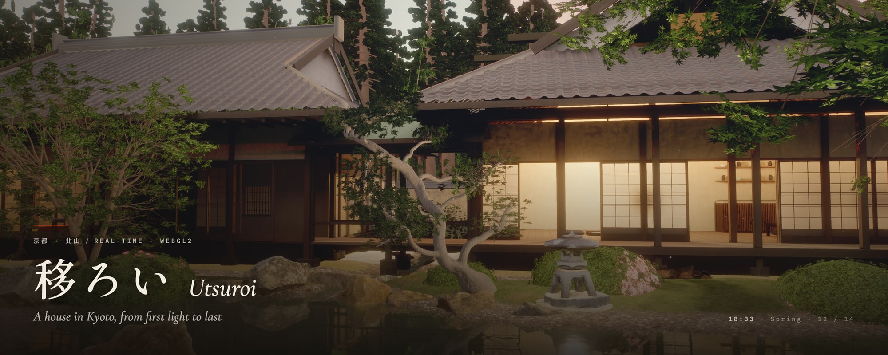
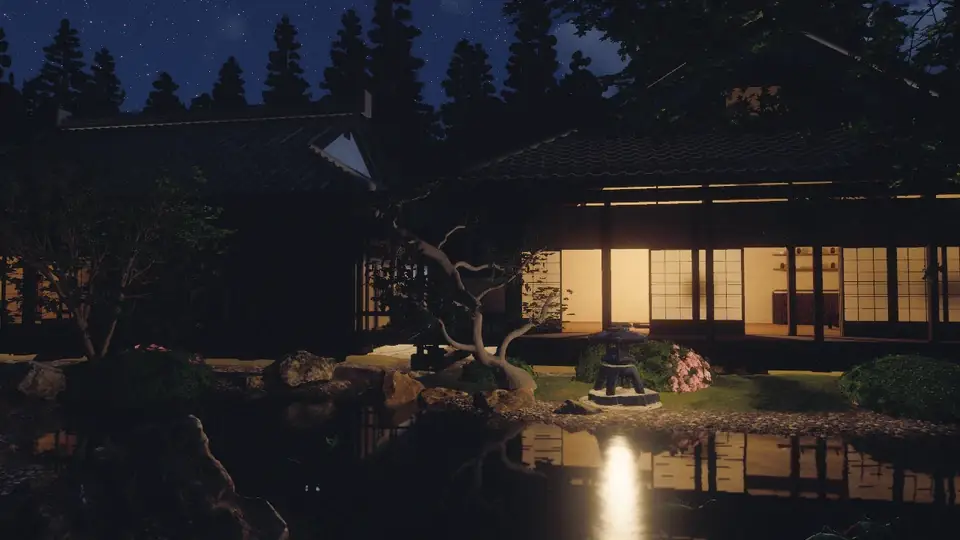
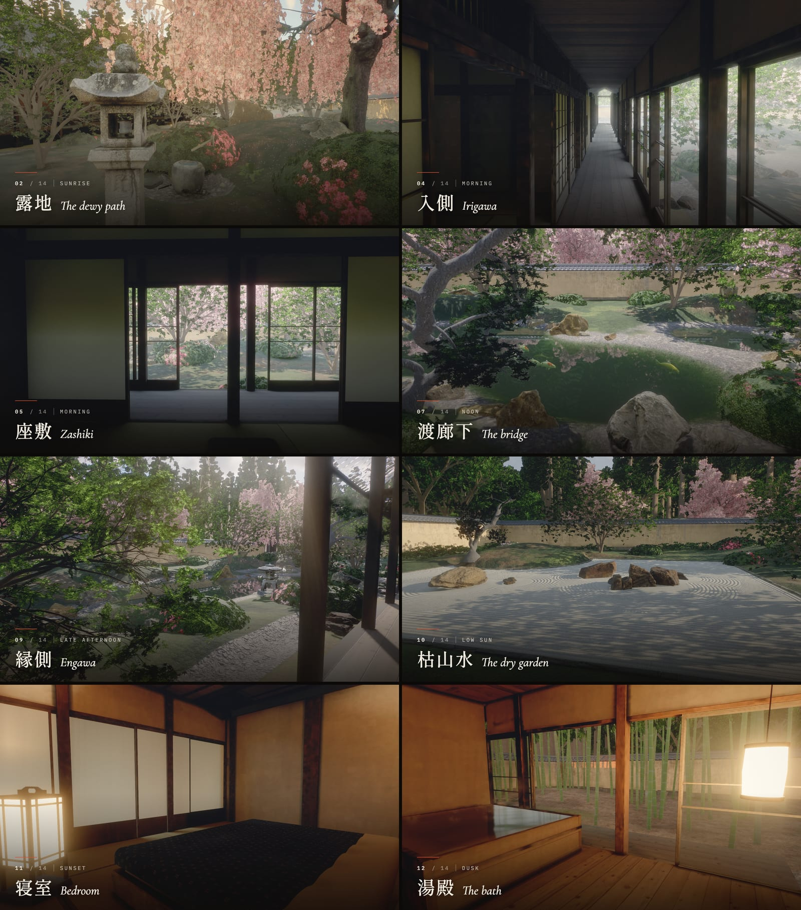
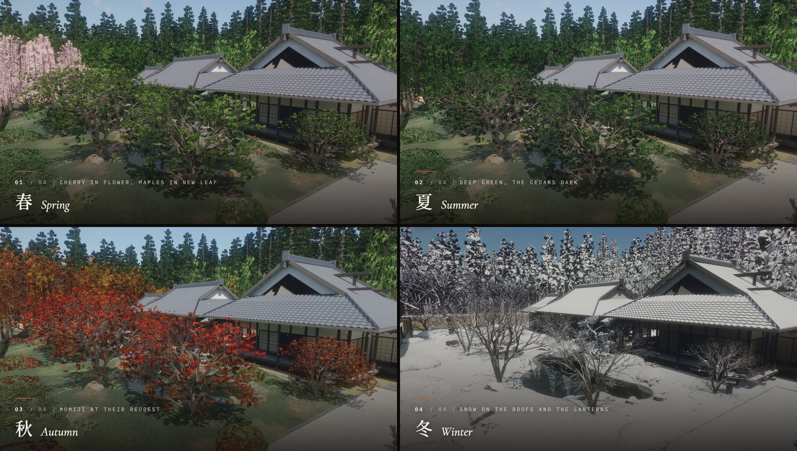
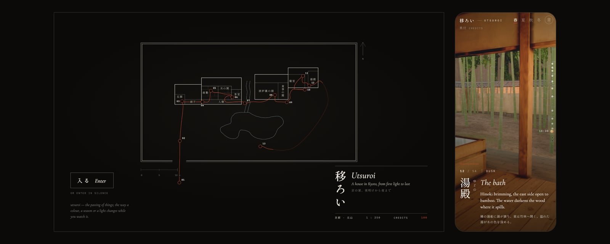
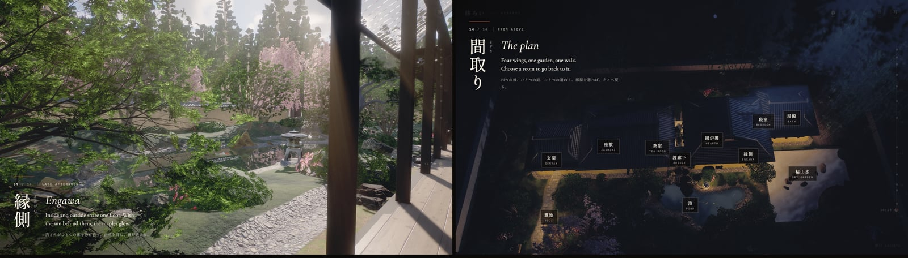
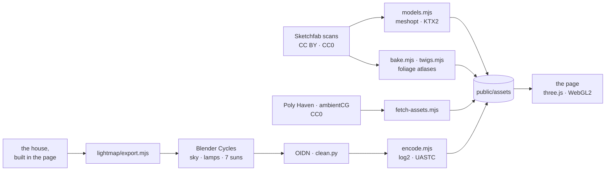

<p align="center">
  <a href="https://billpwchan.github.io/utsuroi/"></a>
</p>

<p align="center">
  <b>A Kyoto house and garden, walked from first light to last, rendered live in the browser.</b><br>
  Scroll, and the day passes.
</p>

<p align="center">
  <a href="https://billpwchan.github.io/utsuroi/"><b>Open the live site</b></a>&nbsp;&nbsp;·&nbsp;&nbsp;<a href="#how-it-is-made">How it is made</a>&nbsp;&nbsp;·&nbsp;&nbsp;<a href="#run-it-locally">Run it locally</a>&nbsp;&nbsp;·&nbsp;&nbsp;<a href="CREDITS.md">Credits</a>
</p>

<p align="center">
  <a href="https://github.com/billpwchan/utsuroi/actions/workflows/pages.yml"></a>
  
  
  <a href="LICENSE"></a>
</p>

<p align="center"><sub><b>English</b> · <a href="README.zh-CN.md">简体中文</a> · <a href="README.ja.md">日本語</a></sub></p>

<br>

> **移ろい** *utsuroi*: the passing of things; the way a colour, a season or a light changes while you watch it.

Utsuroi is a walk through a house in the hills north of Kyoto. Fourteen resting places, from the gate before dawn to the koi pond at night, are joined by one continuous camera path. The scroll is the clock. Between two rooms the sun moves on, and if you stop, it keeps moving.

The stones, trees, lanterns and bowls are scans and models of real ones. The house is built in code on the old Kyoto module, and its light is path-traced offline and blended by the hour. A render-scale governor keeps it at 60 frames a second in a browser tab.

<p align="center">
  
  <br><sub>One view of the pond from 04:45 to 21:00. Nothing is keyframed: the sun follows Kyoto's sky, and the lamps light themselves as it sets.</sub>
</p>

## The walk



門 the gate, before dawn → 露地 the dewy path → 玄関 genkan → 入側 irigawa → 座敷 zashiki → 茶室 the tea room → 渡廊下 the bridge, at noon → 囲炉裏 the hearth → 縁側 engawa → 枯山水 the dry garden → 寝室 bedroom → 湯殿 the bath, at dusk → 夜 night → 間取り the plan, from above.

Between two stops the camera glides through the middle of the scroll and rests at each end while the clock keeps turning. A little scroll at a rest only watches the light move.

## Four seasons



Press <kbd>1</kbd>–<kbd>4</kbd> at any point. Petals drift in spring and fireflies rise over the stream on summer nights. In autumn the maples turn and their leaves fall; in winter snow settles on the roofs and lanterns and the koi go deep. The timetable of the day stays the same in every season, so every season can be walked the same way.

## The interface




While the world loads, the house is drawn as an architect's plan at 1:250, from the same numbers the 3D world is built from. Each stop brings a chapter card in English and Japanese. The ruler on the right is the sun's path from five in the morning to nine at night. The last stop turns the plan into a map, and choosing a room takes you back to it.

Sound is optional and entirely synthesised, with nothing downloaded:
- wind, bamboo, the stream and the tsukubai's drip;
- a bush warbler at a spring dawn, cicadas through a summer day and bell crickets at night;
- the kettle's *wind in the pines* and the nightingale floor under your feet;
- a temple bell far off at sunrise and sunset.

| Key | Action |
|---|---|
| Scroll, <kbd>↓</kbd> <kbd>→</kbd> <kbd>Space</kbd> | next stop |
| <kbd>↑</kbd> <kbd>←</kbd> | previous stop |
| <kbd>Home</kbd> / <kbd>End</kbd> | the gate / the plan |
| <kbd>1</kbd> <kbd>2</kbd> <kbd>3</kbd> <kbd>4</kbd> | spring, summer, autumn, winter |
| <kbd>M</kbd> | sound |
| <kbd>P</kbd> | photo mode, which also prints a postcard (<kbd>Esc</kbd> leaves it) |

## How it is made

Everything is plain [three.js](https://threejs.org) r186, with no engine and no framework. Every surface is a `MeshStandardMaterial` patched with shared shader hooks, so light, air and season reach all of them through one set of uniforms.

### Light

- **The sun and sky.** The sun follows Kyoto's sky at 35° N. Sky, sunlight and ambient colour come from one single-scattering model that the sky shader also uses, so the light on the house always matches the sky behind it. Clouds are a raymarched cumulus layer at half resolution, accumulated over frames.
- **Baked light in the house.** On every load the procedural house gets a second UV set, laid out the same way each time: 13,694 charts shelf-packed into a 4096² atlas.
  - **Bake.** Blender Cycles bakes into that atlas offline: a uniform sky, the lamps, and the sun's bounce light at seven hours (06:00, 07:30, 09:00, 11:30, 14:30, 16:30 and 18:00).
  - **Denoise.** OIDN denoises with chart-id and normal guides, so no chart's light leaks into its neighbour. A last pass pulls the firefly residue out of the faintly lit areas.
  - **Store.** A room's light is a hundredth of the garden's, so the maps are log2-encoded in 8 bits, which spreads them evenly over the stops. They are stored as UASTC KTX2 with mipmaps.
  - **Run time.** The page blends the two sun bakes either side of the hour and adds the direct sun from the shadow map.
  - **Probes.** A 103 × 9 × 30 grid of probes, 40 cm apart, carries the same bakes for objects without a lightmap.
- **Outside.** A sky-visibility volume of 25 cm voxels is baked on the GPU at load. SSAO adds contact shade where a post meets the floor.
- **Air.** Volumetric sunlight is raymarched through the shadow map at quarter resolution. Indoor air is dustier than the garden's, so rooms get shafts of light while views of the garden stay clear.
- **Exposure.** Eye adaptation runs on the GPU and is weighted to the centre of the frame, so a bright doorway does not set a dark room's exposure. AgX tone mapping, bloom, a grade, grain and a sharpening upscale finish the frame.

### Garden and house

- **One site plan.** A single site plan knows where the pond, stream, mounds, paths and walls are. Terrain, the ground shader, water, rocks and planting all read from it, so they always agree.
- **Stone.** Every stone is a scan. The garden's rocks and stepping stones are merged into one mesh per scan: seven draw calls for all of them.
- **Trees.** Trees keep their scanned or modelled wood and carry leaf cards. The leaf and blossom atlases are composed from CC0 specimen scans at the specimens' true size, with the leaves' own normals. The leaves are neutral grey, tinted per season in the shader.
- **Water.** The pond has:
  - planar reflection and refraction through the scene;
  - absorption by optical path, so it reads as a koi pond's green-brown and never a pool's cyan;
  - wind ripples, flow in the stream and sun glitter;
  - caustics on the floor and rings where the koi rise.
- **Koi.** A dozen koi of seven varieties share one scanned carp and swim by a travelling wave down the spine.
- **The house.**
  - **Layout.** It is generated in code on the *kyōma* module: a ken of 1.82 m, openings 1.76 m high, posts 12 cm. It has four wings, irimoya tile roofs, and shoji, fusuma and glass panels.
  - **Materials.** Scanned materials are used where the real thing matters: tatami, hinoki, clay plaster, stone. Canvas-painted maps cover washi, karakami and gold leaf.
  - **Art.** The scrolls and screens are photographs of real works, including Tōhaku's *Pine Trees*.

### The frame

`shadow → mirror → opaque (MSAA) → sky (half res) → water and effects → volumetric light → bloom and adaptation → composite`

A render-scale governor holds 60 fps. It steps down on missed frames and probes back up after a run of clean ones.

Measured at 1920 × 1080 at 2× on an Apple M4 Max in Chrome:
- at rest, p50 is 16.7 ms and p95 is 18.7 ms;
- p99 reaches about 33 ms during the opening and fast scrolls, while textures upload.

Textures are KTX2, transcoded to BC7 or ASTC on the GPU, and geometry is meshopt-compressed. A first visit downloads about 160 MB.



## Run it locally

```bash
git clone https://github.com/billpwchan/utsuroi.git
cd utsuroi
npm install
npm run dev          # http://127.0.0.1:5195
```

You need Node 20.19+ or 22.12+ and a desktop browser with WebGL2. It is developed and measured in Chrome on Apple silicon. The built assets are committed, so the clone is about 160 MB and there is nothing else to fetch. `npm run build` writes a static site to `dist/`, which any static host can serve. `.github/workflows/pages.yml` publishes it to GitHub Pages, and `deploy/` holds a Caddy and Docker setup for a server of your own.

URL parameters help when working on one place:

| Parameter | Effect |
|---|---|
| `?stop=6` | open at a stop (0–13) |
| `?season=2` | 0 spring, 1 summer, 2 autumn, 3 winter |
| `?orbit&h=17.5` | free orbit camera at a fixed hour (<kbd>[</kbd> <kbd>]</kbd> step 15 minutes) |
| `?clean` | hide the interface |
| `?nolm` `?novol` `?noadapt` | switch off baked light, volumetrics or eye adaptation |

### Rebuilding the assets

You don't need any of this to run or change the site. The scripts are here so the pipeline can be read, rerun or adapted. Some assets went through one-off steps that are not automated here: splitting a tree's bark from its leaves, the andon, a few textures and the paintings.

| Script | What it does |
|---|---|
| `scripts/fetch-assets.mjs` | Poly Haven and ambientCG textures and rocks → KTX2 (needs [`basisu`](https://github.com/BinomialLLC/basis_universal)) |
| `scripts/sketchfab.sh`, `scripts/models.mjs` | Sketchfab downloads → web glTF: welded, simplified, meshopt, KTX2 |
| `scripts/bake.mjs`, `twigs.mjs`, `stamps.mjs` | foliage atlases and leaf stamps from the specimen scans |
| `scripts/lightmap/bake.sh` | the house's baked light: export, Cycles, OIDN, encode (Blender, tested with 5.2; about 35 GPU minutes) |
| `scripts/shot.mjs`, `scripts/perf.mjs` | headed screenshots, and frame times as p50 / p95 / p99 |

### Layout

```
src/
  core/      frame pipeline, post, lightmap, GPU bakes, the shared lighting model
  env/       sun, sky, time of day and season
  garden/    site plan, terrain, water, rocks, trees, shrubs, koi, garden structures
  house/     geometry kit, joinery, materials, what the rooms hold
  journey/   the camera path through the fourteen stops
  fx/        SSAO, volumetric light, petals, leaves, snow, fireflies, steam
  audio/     the synthesised soundscape
  ui/        loader plan, chapter cards, day ruler, colophon, all the words
scripts/     asset, lightmap, screenshot and performance tooling
public/      built assets: KTX2 textures, meshopt glTF, baked light
```

## Credits

The garden is made of other people's work: about thirty scans and models from Sketchfab artists, museums and specimen libraries, and Poly Haven and ambientCG surfaces. [CREDITS.md](CREDITS.md) lists every one with its licence, and the site's colophon (奥付) names them too.

The idea of walking a Japanese house through one day owes a debt to Meng To's [Seijaku](https://x.com/MengTo/status/2099898247959691523).

## Licence

The code is [MIT](LICENSE). The assets keep their own licences, listed in [CREDITS.md](CREDITS.md); most are CC0 or CC BY 4.0. One lantern is CC BY-NC-SA 4.0, so replace it before any commercial use. One more lantern, in the author's own build, is under the Sketchfab Standard licence. It is left out of this repository, and another scanned lantern stands in for it.
