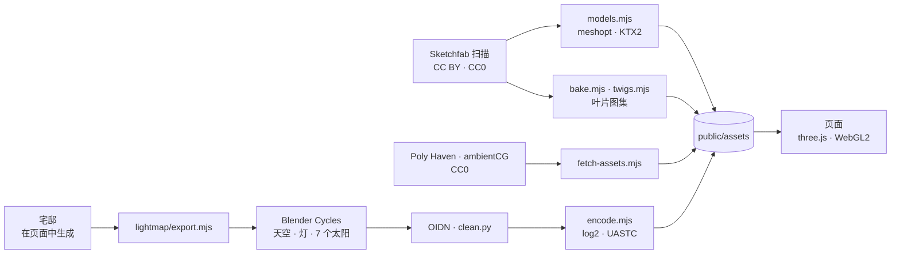

<p align="center">
  <a href="https://billpwchan.github.io/utsuroi/"></a>
</p>

<p align="center">
  <b>一座京都的宅邸与庭院，从破晓走到入夜，在浏览器里实时渲染。</b><br>
  向下滚动，一天就过去了。
</p>

<p align="center">
  <a href="https://billpwchan.github.io/utsuroi/"><b>打开在线版</b></a>&nbsp;&nbsp;·&nbsp;&nbsp;<a href="#它是怎么做的">它是怎么做的</a>&nbsp;&nbsp;·&nbsp;&nbsp;<a href="#在本地运行">在本地运行</a>&nbsp;&nbsp;·&nbsp;&nbsp;<a href="CREDITS.md">致谢</a>
</p>

<p align="center">
  <a href="https://github.com/billpwchan/utsuroi/actions/workflows/pages.yml"></a>
  
  
  <a href="LICENSE"></a>
</p>

<p align="center"><sub><a href="README.md">English</a> · <b>简体中文</b> · <a href="README.ja.md">日本語</a></sub></p>

<br>

> **移ろい** *utsuroi*：事物的流转。一种颜色、一个季节、一束光，在你注视之中悄然改变。

这是一次穿过京都北山一座宅邸的漫步。从黎明前的院门到入夜的锦鲤池，十四个停留点由一条连续的镜头路径串起。滚动就是时钟：从一个房间走到下一个，太阳也随之移动；停下脚步，它也不会停。

石头、树、石灯笼、茶碗，都是真实之物的扫描或模型。房子按京都传统的模数用代码搭建，室内光照离线 path tracing 烘焙，再按时刻混合。一个 render-scale governor 让它在浏览器标签页里稳定在每秒 60 帧。

<p align="center">
  
  <br><sub>同一个视角，从 04:45 到 21:00。没有任何关键帧：太阳沿京都的天空运行，日落时灯会自己亮起。</sub>
</p>

## 一路走过


门（黎明前）→ 露地 → 玄关 → 入侧 → 座敷 → 茶室 → 渡廊下（正午）→ 围炉里 → 缘侧 → 枯山水 → 寝室 → 汤殿（黄昏）→ 夜 → 间取（俯瞰平面图）。

在两个停留点之间，镜头只在滚动区间的中段移动，两端静止而时钟照走。所以在一处停下、轻轻滚动，看到的只是光在移动。

## 四季


随时按 <kbd>1</kbd>–<kbd>4</kbd> 切换。春天樱花瓣飘落，夏夜萤火虫在溪流上方飞起。秋天枫叶转红、随风而落；冬天屋顶和石灯笼积雪，锦鲤沉到深处。四季沿用同一张一天的时刻表，每个季节都可以用同样的方式走一遍。

## 界面


加载时，宅邸被画成一张 1:250 的建筑平面图，所用的数字和搭建 3D 世界的完全相同。每到一处，都会出现一张英日双语的章节卡片。右侧的标尺是太阳的轨迹，从清晨五点到夜里九点。最后一站把平面图变成地图，点选任何一个房间就能回到那里。

声音可选，全部实时合成，没有下载任何音频：
- 风、竹林、溪流、蹲踞的滴水；
- 春日清晨的树莺、夏日的蝉、夜里的金钟儿；
- 铁瓶的“松风”，脚下吱呀如鸟鸣的莺张地板；
- 日出和日落时远处寺院的钟声。

| 按键 | 作用 |
|---|---|
| 滚动、<kbd>↓</kbd> <kbd>→</kbd> <kbd>Space</kbd> | 下一站 |
| <kbd>↑</kbd> <kbd>←</kbd> | 上一站 |
| <kbd>Home</kbd> / <kbd>End</kbd> | 院门 / 平面图 |
| <kbd>1</kbd> <kbd>2</kbd> <kbd>3</kbd> <kbd>4</kbd> | 春、夏、秋、冬 |
| <kbd>M</kbd> | 声音 |
| <kbd>P</kbd> | 摄影模式，还能印出一张明信片（<kbd>Esc</kbd> 退出） |

## 它是怎么做的

全部基于原生 [three.js](https://threejs.org) r186，没有引擎，也没有框架。每个表面都是打了共享 shader hook 的 `MeshStandardMaterial`，光照、空气和季节通过同一组 uniform 传到所有表面。

### 光

- **太阳与天空。** 太阳按北纬 35° 的京都天空运行。天空、阳光和环境光颜色来自同一个单次散射模型，天空 shader 也用它，所以宅邸上的光总和背后的天空一致。云是半分辨率 raymarch 的积云层，跨帧累积。
- **宅邸里的烘焙光照。** 每次加载时，程序生成的宅邸会得到第二套 UV，每次排布都完全相同：13,694 个 chart 以 shelf packing 排进一张 4096² 图集。
  - **烘焙。** Blender Cycles 离线烘焙进这张图集：一个均匀天空、所有灯具，以及太阳在七个时刻的间接光（06:00、07:30、09:00、11:30、14:30、16:30、18:00）。
  - **降噪。** OIDN 以 chart id 和法线作引导降噪，每个 chart 的光不会渗到相邻的 chart。最后一道处理清掉微光区域残留的 firefly。
  - **存储。** 室内的光只有室外的百分之一，所以 lightmap 以 log2 编码进 8 bit，让精度均匀分布在各个曝光档位上，存为带 mipmap 的 UASTC KTX2。
  - **运行时。** 页面混合当前时刻前后两张太阳烘焙，再叠加来自 shadow map 的直射光。
  - **探针。** 一个 103 × 9 × 30、间距 40 cm 的探针网格携带同样的烘焙结果，供没有 lightmap 的物体使用。
- **室外。** 加载时在 GPU 上烘焙一个 25 cm 体素的天空可见度体积。SSAO 补上柱脚与地板交接处这类接触阴影。
- **空气。** 体积光在 1/4 分辨率下沿 shadow map raymarch。室内空气比庭院里的多些尘埃，所以房间里有光柱，望向庭院时仍然通透。
- **曝光。** 人眼适应在 GPU 上计算，并以画面中心加权，所以一扇明亮的门不会决定一个暗房间的曝光。最后经过 AgX tone mapping、bloom、调色、颗粒和锐化放大。

### 庭院与宅邸

- **一张场地规划。** 一份场地规划记录了池塘、溪流、土丘、小径和围墙的位置。地形、地面 shader、水、岩石和植栽都读取它，所以彼此总是吻合。
- **石。** 所有石头都是扫描件。庭院里的岩石和踏脚石按扫描件合并成一个个 mesh，全部只需七个 draw call。
- **树。** 树保留扫描或建模的树干枝条，挂上叶片卡片。叶与花的图集由 CC0 标本扫描按真实尺寸合成，并带有叶片本身的法线。叶片是中性灰，在 shader 里按季节着色。
- **水。** 池塘包含：
  - 平面反射，以及穿过场景的折射；
  - 按光程计算的吸收，读起来是锦鲤池的绿褐色，而不是泳池的青蓝；
  - 风吹的涟漪、溪中的水流、阳光的碎闪；
  - 池底的焦散，以及锦鲤浮起时的水纹。
- **锦鲤。** 十几条、七个品种的锦鲤共用一条扫描的鲤鱼，靠沿脊柱传播的波游动。
- **宅邸。**
  - **布局。** 按“京间”模数用代码生成：一间 1.82 m，开口高 1.76 m，柱 12 cm。四翼、入母屋瓦顶，还有障子、袄和玻璃门。
  - **材质。** 真实质感要紧的地方用扫描材质：榻榻米、桧木、土墙、石头。和纸、唐纸和金箔用 canvas 绘制的贴图。
  - **书画。** 挂轴和屏风是真实作品的照片，包括长谷川等伯的《松林图屏风》。

### 一帧

`shadow → mirror → opaque (MSAA) → sky (half res) → water and effects → volumetric light → bloom and adaptation → composite`

一个 render-scale governor 维持 60 fps：掉帧时降低渲染比例，连续若干干净帧后再试探着升回去。

在 Apple M4 Max 的 Chrome 上，以 1920 × 1080、2× 走完全程测得：
- p50 为 16.7 ms，p95 为 17.6 ms；
- 开场和快速滚动时纹理上传，p99 约 33 ms；
- 渲染比例平均为原尺寸的 0.84。低于原尺寸的画面用 Catmull-Rom 滤波放大，并随比例相应锐化。

纹理是 KTX2，在 GPU 上转码为 BC7 或 ASTC；几何体经 meshopt 压缩。首次访问约下载 160 MB。



## 在本地运行

```bash
git clone https://github.com/billpwchan/utsuroi.git
cd utsuroi
npm install
npm run dev          # http://127.0.0.1:5195
```

需要 Node 20.19+ 或 22.12+，以及支持 WebGL2 的桌面浏览器。开发和测量都在 Apple silicon 上的 Chrome 中进行。构建好的资源已提交进仓库，clone 约 160 MB，无需再下载其他东西。`npm run build` 会在 `dist/` 生成静态站点，任何静态托管都能部署。`.github/workflows/pages.yml` 会把它发布到 GitHub Pages，`deploy/` 里则是一套用于自己服务器的 Caddy 与 Docker 配置。

调试某一处时可以用这些 URL 参数：

| 参数 | 作用 |
|---|---|
| `?stop=6` | 直接打开某一站（0–13） |
| `?season=2` | 0 春，1 夏，2 秋，3 冬 |
| `?orbit&h=17.5` | 自由环绕镜头，固定在某一时刻（<kbd>[</kbd> <kbd>]</kbd> 每次 15 分钟） |
| `?clean` | 隐藏界面 |
| `?nolm` `?novol` `?noadapt` | 关闭烘焙光照、体积光或人眼适应 |

### 重建资源

运行或修改网站都不需要这些。脚本放在这里，方便阅读、重跑或改作他用。有些资源经过一次性的处理，没有在这里自动化：例如把树的枝干和叶子拆开、行灯、少数纹理和书画。

| 脚本 | 用途 |
|---|---|
| `scripts/fetch-assets.mjs` | Poly Haven 与 ambientCG 的纹理和岩石 → KTX2（需要 [`basisu`](https://github.com/BinomialLLC/basis_universal)） |
| `scripts/sketchfab.sh`、`scripts/models.mjs` | Sketchfab 下载 → web glTF：焊接、简化、meshopt、KTX2 |
| `scripts/bake.mjs`、`twigs.mjs`、`stamps.mjs` | 由标本扫描生成叶片图集和单片叶 |
| `scripts/lightmap/bake.sh` | 宅邸的烘焙光照：导出、Cycles、OIDN、编码（Blender，在 5.2 上测试过；约 35 分钟 GPU 时间） |
| `scripts/shot.mjs`、`scripts/perf.mjs` | 有界面浏览器截图，以及 p50 / p95 / p99 帧时间 |

### 目录

```
src/
  core/      帧管线、后期、lightmap、GPU 烘焙、共享光照模型
  env/       太阳、天空、时刻与季节
  garden/    场地规划、地形、水、岩石、树、灌木、锦鲤、庭院构筑物
  house/     几何工具、木作、材质、房间里的陈设
  journey/   贯穿十四站的镜头路径
  fx/        SSAO、体积光、花瓣、落叶、雪、萤火虫、水汽
  audio/     合成的声景
  ui/        加载平面图、章节卡片、日轨标尺、版权页、全部文字
scripts/     资源、lightmap、截图与性能工具
public/      构建好的资源：KTX2 纹理、meshopt glTF、烘焙光照
```

## 致谢

这座庭院是用别人的作品搭起来的：约三十个来自 Sketchfab 创作者、博物馆和标本库的扫描与模型，以及 Poly Haven 和 ambientCG 的材质。[CREDITS.md](CREDITS.md) 逐一列出了每件作品及其许可，网站的版权页（奥付）里也写着他们的名字。

在一天之中走过一座日式宅邸，这个想法受益于 Meng To 的 [Seijaku](https://x.com/MengTo/status/2099898247959691523)。

## 许可

代码采用 [MIT](LICENSE)。资源保留各自的许可，见 [CREDITS.md](CREDITS.md)，大多是 CC0 或 CC BY 4.0。其中一座石灯笼是 CC BY-NC-SA 4.0，商用前请替换。作者自己部署的版本里还有一座采用 Sketchfab Standard 许可的石灯笼，未收入本仓库，由另一座扫描石灯笼代替。
